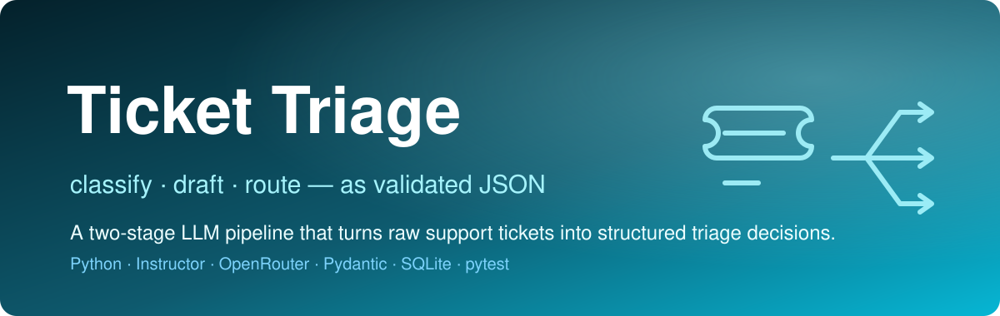

<p align="center">
  
</p>

<h1 align="center">Ticket Triage</h1>

<p align="center"><em>A two-stage LLM pipeline that turns raw support tickets into validated triage decisions and draft replies.</em></p>

<p align="center">
  
  
  
  
  
  
</p>

**Ticket Triage** is a Python backend that classifies an incoming support ticket, drafts a reply, and decides whether that draft can go out automatically or needs a human review — returning **schema-validated JSON** at every step instead of brittle free-form text. It runs two LLM calls per ticket through **OpenRouter** (a cheap model for classification, a stronger one for drafting), shapes both outputs with **Instructor + Pydantic v2**, and persists every decision — including per-call token counts, cost, and latency — to **SQLite**.

> Support teams drown in unstructured tickets. This service turns each raw ticket into a structured, costed, auditable triage decision a workflow or an agent can act on immediately.

---

## ✨ Features

- **Two-stage LLM pipeline** — `classify_ticket` (category + urgency + confidence) followed by a draft-reply stage, each returning a strict Pydantic model.
- **Structured outputs, not parsing** — `Instructor` (`instructor.from_openai`, JSON mode) coerces every LLM response into a validated schema with automatic retries.
- **Confidence-gated routing** — `should_route_to_review` sends a draft straight to auto-draft when both classification and draft confidence clear the threshold (default `0.70`), otherwise it lands in a human review queue.
- **Graceful degradation** — a failed classification falls back to a zero-confidence `general` ticket (which routes to review) instead of crashing the request.
- **Per-ticket cost & token accounting** — `compute_cost` prices each call from a `MODEL_PRICING` table; token counts, cost, retries, and latency are stored on every ticket.
- **Aggregate metrics** — `get_metrics` reports auto-draft rate, average/total cost, average latency, retry counts, and cost broken down by model.
- **SQLite persistence** — full ticket lifecycle (`pending → auto_drafted / review_queue → approved → sent`) stored in a single-file DB.

## 🏗️ Architecture

```
            ┌─────────────┐
  ticket ──▶│  classify   │  mistralai/mistral-7b-instruct
            │ (Instructor)│  ──▶ TicketClassification {category, urgency, confidence}
            └──────┬──────┘
                   │
            ┌──────▼──────┐
            │   draft     │  anthropic/claude-3-haiku
            │ (Instructor)│  ──▶ DraftReply {subject, body, tone, confidence}
            └──────┬──────┘
                   │
        ┌──────────▼───────────┐
        │ should_route_to_review│  confidence < 0.70 ?
        └─────┬───────────┬─────┘
              │ no        │ yes
        ┌─────▼────┐ ┌────▼────────┐
        │auto_draft│ │review_queue │
        └─────┬────┘ └────┬────────┘
              └─────┬──────┘
            ┌───────▼────────┐
            │  SQLite store  │  ticket + trace (tokens, cost, latency)
            └────────────────┘
```

**Layout**

```
backend/
  pipeline/
    classify.py      # classification stage + fallback
    triage.py        # should_route_to_review (confidence gate)
    openrouter.py    # Instructor/OpenRouter client, llm_call, compute_cost, MODEL_PRICING
  models/
    schemas.py       # Pydantic contracts: Ticket, TicketClassification, DraftReply, TicketTrace, MetricsResponse
  db/
    sqlite.py        # Database: insert/update/list tickets + get_metrics
  kb/                # placeholder for ChromaDB knowledge-base retrieval (not yet wired)
  config.py          # pydantic-settings: models, threshold, paths, API key
tests/               # pytest suite (schemas, routing, costs, db)
conftest.py          # injects a dummy OPENROUTER_API_KEY for unit tests
```

> Note: `fastapi`, `uvicorn`, and `chromadb` are listed in `requirements.txt` as the intended serving + retrieval layer, but the HTTP API and ChromaDB KB are not implemented in this snapshot. What runs today is the pipeline, routing, cost accounting, and persistence — all covered by tests.

## 🚀 Run it

```bash
cd backend
python -m venv venv && source venv/bin/activate   # Windows: venv\Scripts\activate
pip install -r requirements.txt
```

Configure an OpenRouter key for live LLM calls (create `backend/.env`):

```bash
OPENROUTER_API_KEY=sk-or-...
# optional overrides:
# CLASSIFICATION_MODEL=mistralai/mistral-7b-instruct
# DRAFT_MODEL=anthropic/claude-3-haiku-20240307
# CONFIDENCE_THRESHOLD=0.70
```

The unit tests run without a real key — `conftest.py` injects a dummy one.

## 🧪 Tests

```bash
# from the repo root
pip install -r backend/requirements.txt
pytest
```

Covers the parts that run today, with no network calls:

- **`test_schemas.py`** — Pydantic validation: bad categories and out-of-range confidence are rejected.
- **`test_routing.py`** — the confidence gate, including the exact-threshold and zero-confidence edge cases.
- **`test_costs.py`** — `compute_cost` pricing for known models and `0.0` for unknown models / zero tokens.
- **`test_db.py`** — insert / get / list tickets, status updates, and empty-DB metrics.

## 🔧 Configuration

Defined in `backend/config.py` via `pydantic-settings` (env vars or `.env`):

| Setting | Default | Purpose |
|---|---|---|
| `openrouter_api_key` | _required_ | Fails fast if unset |
| `classification_model` | `mistralai/mistral-7b-instruct` | Cheap classifier |
| `draft_model` | `anthropic/claude-3-haiku-20240307` | Reply drafter |
| `confidence_threshold` | `0.70` | Auto-draft vs. review-queue cutoff |
| `max_retries` | `2` | Instructor structured-output retries |
| `sqlite_path` | `./tickets.db` | Ticket store |
| `chroma_path` | `./chroma_db` | Reserved for the planned KB layer |

## 🗺️ Roadmap

- Wire the FastAPI service (`/tickets`, `/metrics`, review-queue endpoints) over the existing pipeline.
- Implement the ChromaDB knowledge-base layer so drafts cite real `kb_sources`.
- End-to-end test against a live OpenRouter call (gated behind a real key).
